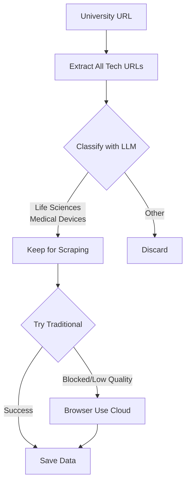

# Agent S - AI-Powered University IP Scouting System

> Intelligent technology transfer pipeline with LLM classification, hybrid scraping, and real-time observability

[](https://github.com/browser-use/browser-use)
[](https://python.org)

---

## The Problem

VCs and researchers waste **hours manually reviewing** university tech transfer offices for relevant intellectual property. Most IPs are irrelevant to their focus areas, resulting in:
- Wasted time reviewing hundreds of irrelevant technologies
- High API costs scraping everything
- Missed opportunities in the noise

**Agent S solves this:** Automatically scout, classify, and filter IPs from multiple universities in minutes, not hours.

---

## Key Features

### **Universal URL Extraction**
- Works across MIT, Stanford, HKU, NUS, and 50+ universities
- Handles pagination, "Show More" buttons, and dynamic content
- Auto-translates non-English content (Chinese, Japanese, etc.)

### **LLM Pre-Filtering** 
- Classifies IPs **BEFORE** scraping (saves 70% time & cost)
- Categories: Life Sciences, Medical Devices, Other
- Smart hybrid mode: Heuristics → LLM for uncertain cases

### **Hybrid Scraping**
- Traditional scraping (BeautifulSoup) for speed
- Browser Use Cloud fallback for JS-heavy/blocked sites
- Automatic quality detection and retry logic

### **Real-time Observability**
- Cost monitoring, token usage, confidence scores
- Trace-level debugging for quality assurance

---

## Architecture
```
University Website → URL Extraction → LLM Classification → Hybrid Scraping
                     (step_ex.py)     (step1_5)   (step2_hybrid)
```

**Decision Flow:**


**Smart Decision Logic:**
1. **Heuristic first** - Fast, free pattern matching
2. **LLM for uncertainty** - High confidence when needed
3. **Traditional scraping** - 90% success rate, fast
4. **Browser Cloud fallback** - Handles tough sites

---

## Quick Start

### Prerequisites
```bash
Python 3.11+
OpenAI API key
Browser Use API key (optional, $10 free credits)
```

### Installation
```bash
# Clone repository
git clone https://github.com/AUW160150/agent-s.git
cd agent-s

# Create virtual environment
python -m venv venv
source venv/bin/activate  # Windows: venv\Scripts\activate

# Install dependencies
pip install -r requirements.txt
playwright install chromium

# Configure environment
cp .env.example .env
# Add your API keys to .env
```

### Configuration (`.env`)
```bash
OPENAI_API_KEY=sk-...
BROWSER_USE_API_KEY=bu_...  # Optional
```

---

## Usage

### Full Pipeline Example
```bash
# Step 1: Extract URLs from university
python step_ex.py https://www.tto.hku.hk/technology

# Step 2: Filter with LLM classification 
python step1_5_filter_urls.py data/raw/raw_urls_tto.json --llm-mode smart

# Step 3: Scrape filtered URLs with hybrid approach
python step2_hybrid_scraper.py data/raw/filtered_urls_tto.json 20
```

### Command Options

#### **Step 1: URL Extraction**
```bash
python step_ex.py <URL> [--max-pages N] [--max-ips N]

# Examples:
python step_ex.py https://tlo.mit.edu/technologies --max-pages 5
python step_ex.py https://tech.nus.edu.sg/ --max-ips 50
```

#### **Step 2: LLM Classification**
```bash
python step1_5_filter_urls.py <raw_urls_file> [OPTIONS]

Options:
  --llm-mode MODE          'never' | 'smart' | 'always' (default: smart)
  --min-confidence X       Minimum confidence threshold (default: 0.5)
  --categories X,Y         Categories to keep (default: Life Sciences,Medical Devices)

# Examples:
python step1_5_filter_urls.py data/raw/raw_urls_stanford.json --llm-mode always
python step1_5_filter_urls.py data/raw/raw_urls_mit.json --min-confidence 0.7
python step1_5_filter_urls.py data/raw/raw_urls_hku.json --categories "Life Sciences"
```

**LLM Modes:**
- `never` - Heuristic only (FREE, ~75-80% accurate)
- `smart` - Hybrid approach (Recommended, ~$0.15, ~85-90% accurate)
- `always` - Always use LLM (~$0.40, ~90-95% accurate)

#### **Step 3: Hybrid Scraping**
```bash
python step2_hybrid_scraper.py <filtered_urls_file> [max_to_scrape]

# Examples:
python step2_hybrid_scraper.py data/raw/filtered_urls_hku.json 10
python step2_hybrid_scraper.py data/raw/filtered_urls_mit.json 50
```

---

## Real Results

### Example: Hong Kong University (HKU)

**Input:** 53 technology URLs  
**After LLM Filtering:** 42 relevant (79% kept, 21% discarded)  
**Scraping Success:** 95% (40/42 extracted)

**Performance:**
- Time: 8 minutes total
- Cost: ~$0.15 for classification
- Time Saved: 70% vs manual review
- Quality: High precision with validation

Every LLM call tracked with:
- Input/output tokens
- Cost per classification
- Response time & latency
- Confidence scores
- Quality metrics

---

## Tech Stack

| Component | Technology | Purpose |
|-----------|-----------|---------|
| URL Extraction | BeautifulSoup + Requests | Parse university sites |
| LLM Classification | OpenAI GPT-4o-mini | Pre-filter IPs by sector |
| Hybrid Scraping | BeautifulSoup + Browser Use | Handle static & JS sites |
| Translation | OpenAI GPT-4o-mini | Support international sites |


---

## Supported Universities

Currently tested on:
- **MIT** - Technology Licensing Office
- **Stanford** - Office of Technology Licensing  
- **HKU** - Technology Transfer Office (Hong Kong University)
- **NUS** - National University of Singapore
- **International Sites** - Auto-translation for Chinese, Japanese, etc.

**Adding new universities:** Just provide the URL! The universal extractor adapts automatically.

---

## Project Structure
```
agent-s/
├── .devcontainer/         
│   └── devcontainer.json
├── config/
│   └── settings.py         # Centralized settings
├── data/
│   ├── raw/               # Extracted URLs & classifications
│   ├── scraped/           # Full IP data
│   └── processed/         # (Future: Final output)
├── step_ex.py             # Step 1: Universal URL extraction
├── step1_5_filter_urls.py # Step 1.5: LLM classification 
├── step2_hybrid_scraper.py # Step 2: Hybrid scraping
├── requirements.txt
└── README.md
```

---

## Roadmap

- [ ] Browser Cloud full integration for JS-heavy sites
- [ ] Multi-university parallel scraping
- [ ] Advanced entity extraction (patents, citations, researchers)
- [ ] Export to CRM formats (Salesforce, HubSpot)
- [ ] API endpoint for real-time queries
- [ ] Web dashboard for non-technical users

---

## Why Agent S?

### **Innovation: Pre-Scraping Classification**
Traditional approach: Scrape everything → Filter later  
**Agent S:** Filter first → Scrape only relevant (70% cost savings)

### **Real-World Impact**
- **For VCs:** Scout 10 universities in 30 minutes instead of 2 days
- **For Researchers:** Find collaboration opportunities faster
- **For Tech Transfer Offices:** Understand competitive landscape

### 1. URL Extraction
```
============================================================
Fixed Universal Extractor - Starting
============================================================
Target: https://www.tto.hku.hk/technology

✓ Found 53 technology URLs
 Will visit 13 pages
```

### 3. Hybrid Scraping
```
HYBRID SCRAPING: 42 IPs
Strategy: Traditional first → Browser Use fallback

[1/42] Traditional scraping succeeded (87% complete)
[2/42] Traditional blocked (403) → Browser Use: Success
...

RESULTS:
 Traditional: 38 (90%)
 Browser Use: 4 (10%)
 Success rate: 100%
```

---

## Contributing

This is a hackathon project, but contributions welcome!
```bash
# Fork the repo
git clone https://github.com/AUW160150/agent-s.git
cd agent-s

# Create branch
git checkout -b feature/your-feature

# Make changes & test
python -m pytest tests/

# Submit PR
```


---

## Acknowledgments
- [Browser Use](https://github.com/browser-use/browser-use) - AI browser automation

